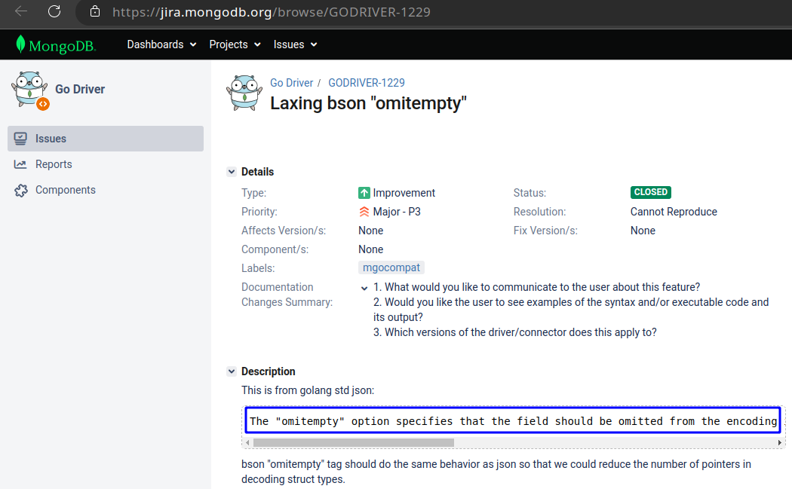

# MongoDB Model Design

## Omitempty 

### Features

> 1. It's important to note that `the omitempty option` only works with `empty values, which are defined as false, 0, a nil pointer, a nil interface, or an empty array or slice`. 
> 2. If a field has a non-empty value, it will be included in the encoding regardless of whether omitempty is used or not.
>
> > Here's a [link](https://jira.mongodb.org/browse/GODRIVER-1229)
> > 


In MongoDB, default values are `different` for some Golang types. (MongoDB 有 null，Golang 有 nil)

These types include `pointers, slices, maps, and structs` in Golang.

The default values may be `unknown`. (未知的数值写入)

Using omitempty can avoid filling in `MongoDB's default values` and directly get zero or empty values.

(for example, sometimes the default value is `NULL` and it is not known `what it is`).

(2023/4/28)

### Usage rules

(empty)

## Polymorphic Pattern

### Introduction

MongoDB’s polymorphic schema allows for storing different types of documents in the same collection and adding new types of documents without affecting existing ones.

### Pros and Cons

Pros:

- It is **convenient** to store documents of **different types in the same collection** without needing to pre-define the schema of the collection.
- Allowing the use of **the same set of APIs** to handle different types of documents makes for **simpler usage**.
- Allowing retrieval of **multiple types** of documents in **a single query** significantly **reduces query time**
- Storing different types of documents in the same collection can **reduce the storage space** needed for **indexing** and avoid creating multiple collections for different document types.

Cons:

1. Switching between **different types** of data leads to **some performance loss**
2. There may be a problem when **querying a collection** that contains some documents with **a specific field** while others do not have that field
3. If you need to add **a new type** of document, you may need to modify **the program** to accommodate the new type.
4. Due to the need for **type conversion**, there may also be **an increase in code complexity** and the possibility of errors.

### Example

#### In Mongosh

 Connect to MongoDB

```bash
$ systemctl start mongod.service

$ mongosh

$ use model
```

Insert the following data.

```json
$ db.model.insertMany([{
    "name": "Savannah",
    "landAnimals": [
        {
            "name": "Lion"
        },
        {
            "name": "Zebra"
        },
        {
            "name": "Giraffe"
        }
    ]
},
{
    "name": "Coral Reef",
    "aquaticAnimals": [
        {
            "name": "Clownfish"
        },
        {
            "name": "Starfish"
        },
        {
            "name": "Seahorse"
        }
    ]
}])

```

delete the data
```json
$ db.model.deleteMany({ $or: [{ name: "Savannah" }, { name: "Coral Reef" }] })
```

#### In Golang

```go
package main

import (
	"context"
	"fmt"
	"log"

	"go.mongodb.org/mongo-driver/bson"
	"go.mongodb.org/mongo-driver/mongo"
	"go.mongodb.org/mongo-driver/mongo/options"
)

/*
Define the structure for the data model,
including optional fields for land and aquatic animals
*/
type model struct {
	Name           string          `bson:"name"`
	LandAnimals    []LandAnimal    `bson:"landAnimals,omitempty"`
	AquaticAnimals []AquaticAnimal `bson:"aquaticAnimals,omitempty"`
}


// Define the structure for land animals
type LandAnimal struct {
	Name string `bson:"name"`
}

// Define the structure for aquatic animals
type AquaticAnimal struct {
	Name string `bson:"name"`
}

func main() {
	// Establish a connection to the MongoDB instance
	clientOptions := options.Client().ApplyURI("mongodb://localhost:27017")
	client, err := mongo.Connect(context.Background(), clientOptions)
	if err != nil {
		log.Fatal(err)
	}
    defer client.Disconnect(context.Background())

	// Verify that the connection was successful
	err = client.Ping(context.Background(), nil)
	if err != nil {
		log.Fatal(err)
	}
	fmt.Println("Connected to MongoDB!")

	// Get a handle to the "model" collection within the "model" database
	modelCollection := client.Database("model").Collection("polymorphic")

	// Insert two documents into the collection, each with a different set of animals
	_, err = modelCollection.InsertMany(context.Background(), []interface{}{
        // First document with land animals
		model{
			Name: "Savannah",
			LandAnimals: []LandAnimal{
				{Name: "Lion"},
				{Name: "Zebra"},
				{Name: "Giraffe"},
			},
		},
        // Second document with aquatic animals
		model{
			Name: "Coral Reef",
			AquaticAnimals: []AquaticAnimal{
				{Name: "Clownfish"},
				{Name: "Starfish"},
				{Name: "Seahorse"},
			},
		},
	})
	if err != nil {
		log.Fatal(err)
	}
	fmt.Println("Data inserted successfully!")

	// Query the collection for the documents that match the specified filter (by name)
    filter := bson.M{"name": bson.M{"$in": []string{"Savannah", "Coral Reef"}}}
	cur, err := modelCollection.Find(context.Background(), filter)
	if err != nil {
		log.Fatal(err)
	}
	defer cur.Close(context.Background())
    
    /*
        Iterate over the cursor and decode each document into a "model" object,
        adding it to a slice of models
    */
	var models []model
	for cur.Next(context.Background()) {
		var model model
		err := cur.Decode(&model)
		if err != nil {
			log.Fatal(err)
		}
		models = append(models, model)
	}
	if err := cur.Err(); err != nil {
		log.Fatal(err)
	}
	fmt.Printf("Data queried successfully: %v\n", models)

	// Delete all documents that match the specified filter
	_, err = modelCollection.DeleteMany(context.Background(), filter)
	if err != nil {
		log.Fatal(err)
	}
	fmt.Println("Data deleted successfully!")
}
```

## Subset Pattern

### Introduction

**The subset pattern** is a way to solve **the problem of the working set exceeding RAM**. This allows the working set to be reduced by introducing only a part or subset of the overall data.

For example

Suppose an e-commerce website has a product review list.

When accessing the product data, we are likely to only need **the most recent 10 or so reviews**. Instead of storing all the reviews with the product, we can divide them into two collections.

One collection has **the main data of the product**.

The other collection has **less frequently used review data.**

### Pros and Cons

Pros:

- Reduces **the number of queries** and retrieves all necessary data at once.
- Maintains **data consistency** and avoids issues with invalid or out-of-sync references.
- Can use **indexing** and aggregation functions to quickly process embedded documents.

Cons:

- Must update or delete data in **another collection** synchronously.
- Stores partially **duplicated data** in two collections.
- Need to ensure that data in the subset is **synchronized with data in another collection**.

### Example

#### In Mongosh

##### Step1:

Creates a products collection in a database and inserts two documents representing products with their details and reviews

```json
// Creates a new collection called products
$ db.createCollection("products")

// Inserts multiple documents into the products collection 
$ db.products.insertMany([
  {
    name: "iPhone 14",
    price: 999,
    description: "iPhone 14 is the latest smartphone from Apple, featuring a powerful A16 processor, a high-resolution OLED screen, an innovative Face ID technology and wireless charging.",
    category: "phone",
    reviews: [
      {
        name: "Zhang San",
        content: "This is the best phone I have ever used, fast, clear, functional, highly recommended!",
        rating: 5
      },
      {
        name: "Li Si",
        content: "This phone is pretty good, but the battery life is not enough, I hope the next generation can improve.",
        rating: 4
      }
    ]
  },
  {
    name: "AirPods Pro",
    price: 249,
    description: "AirPods Pro are wireless noise-canceling headphones from Apple, featuring active noise cancellation, transparency mode, adaptive EQ and spatial audio, letting you enjoy a high-quality listening experience.",
    category: "headphone",
    reviews: [
      {
        name: "Wang Wu",
        content: "These headphones are really great, the noise cancellation is very good, the sound quality is also very clear, and they are very comfortable.",
        rating: 5
      },
      {
        name: "Zhao Liu",
        content: "These headphones are okay, but the price is a bit expensive, and they are easy to fall off.",
        rating: 3
      }
    ]
  }
])
```

Response

```json
{
  acknowledged: true,
  insertedIds: {
    '0': ObjectId("643401169147cacadb0f37d1"), // This is the _id of iPhone 14
    '1': ObjectId("643401169147cacadb0f37d2") // This is the _id of AirPods Pro
  }
}

```

##### Step2:

Creates a reviews collection in a database and inserts four documents representing reviews with their details

The ObjectId was copied from the previous command !

```json
// Creates a new collection called reviews
$ db.createCollection("reviews")

// Inserts multiple documents into the reviews collection
$ db.reviews.insertMany([
  {
    product_id: ObjectId("643401169147cacadb0f37d1"), // This is the _id of iPhone 14 (This was copied from the previous command.)
    name: "Zhang San",
    content: "This is the best phone I have ever used, fast, clear, functional, highly recommended!",
    rating: 5
  },
  {
    product_id: ObjectId("643401169147cacadb0f37d1"), // This is the _id of iPhone 14 (This was copied from the previous command.)
    name: "Li Si",
    content: "This phone is pretty good, but the battery life is not enough, I hope the next generation can improve.",
    rating: 4
  },
  {
    product_id: ObjectId("643401169147cacadb0f37d2"), // This is the _id of AirPods Pro (This was copied from the previous command.)
    name: "Wang Wu",
    content: "These headphones are really great, the noise cancellation is very good, the sound quality is also very clear, and they are very comfortable.",
    rating: 5
  },
  {
    product_id: ObjectId("643401169147cacadb0f37d2"), // This is the _id of AirPods Pro (This was copied from the previous command.)
    name: "Zhao Liu",
    content: "These headphones are okay, but the price is a bit expensive, and they are easy to fall off.",
    rating: 3
  }
])
```

##### Step3:

Creates, retrieves and drops indexes on the products collection

```json
// Creates an index on the name field of the products collection
$ db.products.createIndex({name: 1})

// Retrieves a list of all indexes on the products collection
$ db.products.getIndexes()
[
  { v: 2, key: { _id: 1 }, name: '_id_' },
  { v: 2, key: { name: 1 }, name: 'name_1' }
]

// Drops the index called name_1 from the products collection
$ db.products.dropIndex("name_1")

// Retrieves a list of all indexes on the products collection
$ db.products.getIndexes()
[
  { v: 2, key: { _id: 1 }, name: '_id_' },
]
```

##### Step4:

Joins data from reviews and products collections and returns the execution time

```json
$ db.products.aggregate([ { $lookup: { from: "reviews", localField: "_id", foreignField: "product_id", as: "reviews2" } }]).explain("executionStats").executionStats.executionTimeMillis
1
```

##### Step5:

Joins data from reviews and products collections

```json
$ db.products.aggregate([
  {$lookup: {
    from: "reviews",
    localField: "_id",
    foreignField: "product_id",
    as: "reviews2"
  }}
])
```

Response

Note that both the reviews and reviews2 arrays have content !

```json
[
  {
    _id: ObjectId("643401169147cacadb0f37d1"),
    name: 'iPhone 14',
    price: 999,
    description: 'iPhone 14 is the latest smartphone from Apple, featuring a powerful A16 processor, a high-resolution OLED screen, an innovative Face ID technology and wireless charging.',
    category: 'phone',
    reviews: [
      {
        name: 'Zhang San',
        content: 'This is the best phone I have ever used, fast, clear, functional, highly recommended!',
        rating: 5
      },
      {
        name: 'Li Si',
        content: 'This phone is pretty good, but the battery life is not enough, I hope the next generation can improve.',
        rating: 4
      }
    ],
    reviews2: [
      {
        _id: ObjectId("643402969147cacadb0f37d3"),
        product_id: ObjectId("643401169147cacadb0f37d1"),
        name: 'Zhang San',
        content: 'This is the best phone I have ever used, fast, clear, functional, highly recommended!',
        rating: 5
      },
      {
        _id: ObjectId("643402969147cacadb0f37d4"),
        product_id: ObjectId("643401169147cacadb0f37d1"),
        name: 'Li Si',
        content: 'This phone is pretty good, but the battery life is not enough, I hope the next generation can improve.',
        rating: 4
      }
    ]
  },
  {
    _id: ObjectId("643401169147cacadb0f37d2"),
    name: 'AirPods Pro',
    price: 249,
    description: 'AirPods Pro are wireless noise-canceling headphones from Apple, featuring active noise cancellation, transparency mode, adaptive EQ and spatial audio, letting you enjoy a high-quality listening experience.',
    category: 'headphone',
    reviews: [
      {
        name: 'Wang Wu',
        content: 'These headphones are really great, the noise cancellation is very good, the sound quality is also very clear, and they are very comfortable.',
        rating: 5
      },
      {
        name: 'Zhao Liu',
        content: 'These headphones are okay, but the price is a bit expensive, and they are easy to fall off.',
        rating: 3
      }
    ],
    reviews2: [
      {
        _id: ObjectId("643402969147cacadb0f37d5"),
        product_id: ObjectId("643401169147cacadb0f37d2"),
        name: 'Wang Wu',
        content: 'These headphones are really great, the noise cancellation is very good, the sound quality is also very clear, and they are very comfortable.',
        rating: 5
      },
      {
        _id: ObjectId("643402969147cacadb0f37d6"),
        product_id: ObjectId("643401169147cacadb0f37d2"),
        name: 'Zhao Liu',
        content: 'These headphones are okay, but the price is a bit expensive, and they are easy to fall off.',
        rating: 3
      }
    ]
  }
]
```

Step6:

Drop data from reviews and products collections

```json
$ db.products.drop()
true

$ db.reviews.drop()
true
```

#### In Golang

```go
package main

import (
	"context"
	"fmt"
	"go.mongodb.org/mongo-driver/bson"
	"go.mongodb.org/mongo-driver/bson/primitive"
	"go.mongodb.org/mongo-driver/mongo"
	"go.mongodb.org/mongo-driver/mongo/options"
	"log"
)

// Product struct represents a product in a store
type Product struct {
	ID       primitive.ObjectID `bson:"_id,omitempty"`
	Name     string             `bson:"name,omitempty"`
	Price    float64            `bson:"price,omitempty"`
	Reviews1 []Review           `bson:"reviews1,omitempty"`
	Reviews2 []Review           `bson:"reviews2,omitempty"`
}

// Review represents a customer review of a product type Review
type Review struct {
	ID        primitive.ObjectID `bson:"_id,omitempty"`
	ProductID primitive.ObjectID `bson:"product_id,omitempty"`
	Rating    int                `bson:"rating,omitempty"`
	Comment   string             `bson:"comment,omitempty"`
}

func main() {
	// Establish a connection to the MongoDB instance
	client, err := mongo.Connect(context.Background(), options.Client().ApplyURI("mongodb://localhost:27017"))
	if err != nil {
		panic(err)
	}
	defer client.Disconnect(context.Background())

	// productCollection is a variable that holds a reference to the products collection in the subset database
	productCollection := client.Database("subset").Collection("products")
	// reviewCollection is a variable that holds a reference to the reviews collection in the subset database
	reviewCollection := client.Database("subset").Collection("reviews")

	// product is a variable that holds a Product struct with some values
	product := Product{
		ID:    primitive.NewObjectID(),
		Name:  "iPhone 12",
		Price: 799.99,
		Reviews1: []Review{
			{
				Rating:  5,
				Comment: "highly recommend!",
			},
			{
				Rating:  5,
				Comment: "it easy to read and watch videos.",
			},
		},
	}
	// productResult is a variable that holds the result of inserting the product into the productCollection
	productResult, err := productCollection.InsertOne(context.Background(), product)
	if err != nil {
		panic(err)
	}
	fmt.Println("ID of the inserted product", productResult)

	// review1, review2, and review3 are variables that hold Review structs with some values
	review1 := Review{
		ID:        primitive.NewObjectID(),
		ProductID: product.ID,
		Rating:    5,
		Comment:   "Awesome phone!",
	}
	review2 := Review{
		ID:        primitive.NewObjectID(),
		ProductID: product.ID,
		Rating:    4,
		Comment:   "Good camera quality.",
	}
	review3 := Review{
		ID:        primitive.NewObjectID(),
		ProductID: product.ID,
		Rating:    3,
		Comment:   "Battery life could be better.",
	}

	// reviewResult is a variable that holds the result of inserting the three reviews into the reviewCollection
	reviewResult, err := reviewCollection.InsertMany(context.Background(), []interface{}{review1, review2, review3})
	if err != nil {
		panic(err)
	}
	fmt.Println("IDs of the inserted product reviews", reviewResult.InsertedIDs)

	// Update one document in the productCollection
	_, err = productCollection.UpdateOne(
		context.Background(),
		// bson.M is a map that specifies the filter condition for finding the product by its ID
		bson.M{"_id": product.ID},
		// bson.D is a slice of key-value pairs that specifies the update operation to set the reviews field to a slice of Review structs
		bson.D{
			{"$set", bson.D{{"reviews", []Review{review1, review2, review3}}}},
		},
	)
	if err != nil {
		panic(err)
	}

	// pipeline is a variable that holds an aggregation pipeline to join the products and reviews collections
	pipeline := mongo.Pipeline{
		{{"$match", bson.D{{"_id", product.ID}}}}, // match the product by ID
		{{"$lookup", bson.D{ // lookup the reviews by product ID
			{"from", "reviews"},
			{"localField", "_id"},
			{"foreignField", "product_id"},
			{"as", "reviews2"},
		}}},
	}

	// cursor is a variable that holds the result of running the aggregation pipeline on the productCollection
	cursor, err := productCollection.Aggregate(context.Background(), pipeline)
	if err != nil {
		panic(err)
	}
	defer cursor.Close(context.Background())

	// Iterate over the cursor and print out each product with its reviews
	for cursor.Next(context.Background()) {
		var p Product
		err := cursor.Decode(&p)
		if err != nil {
			panic(err)
		}
		fmt.Println("Product:", p.Name, "Price:", p.Price)
		fmt.Println("Reviews1:")
		for _, r := range p.Reviews1 {
			fmt.Println("Rating:", r.Rating, "Comment:", r.Comment)
		}
		fmt.Println("Reviews2:")
		for _, r := range p.Reviews2 {
			fmt.Println("Rating:", r.Rating, "Comment:", r.Comment)
		}
	}

	// Drop the collection to clean up the data
	err = productCollection.Drop(context.Background())
	if err != nil {
		log.Fatal(err)
	}
	err = reviewCollection.Drop(context.Background())
	if err != nil {
		log.Fatal(err)
	}
}

// go run subset.go

// Note that both the reviews1 and reviews2 arrays have content !

/*
ID of the inserted product &{ObjectID("6434052e3e9f996b6396e329")}
IDs of the inserted product reviews [ObjectID("6434052f3e9f996b6396e32a") ObjectID("6434052f3e9f996b6396e32b") ObjectID("6434052f3e9f996b6396e32c")]
Product: iPhone 12 Price: 799.99
Reviews1:
Rating: 5 Comment: highly recommend!
Rating: 5 Comment: it easy to read and watch videos.
Reviews2:
Rating: 5 Comment: Awesome phone!
Rating: 4 Comment: Good camera quality.
Rating: 3 Comment: Battery life could be better.
*/
```

## Bucket Pattern

### Introduction


```bash
```


### Use bucket Index


```bash

$ mongosh

$ use test

$ db.createCollection("products")

$ for (let i = 1; i <= 1000; i++) {
   db.products.insertOne({
      name: "product" + i,
      price: Math.floor(Math.random() * 1000)   //随机价格1-1000
   })
}

$ db.products.createIndex(
   { price: 1 }, 
   { bucketSize: 50 }
)  
```


